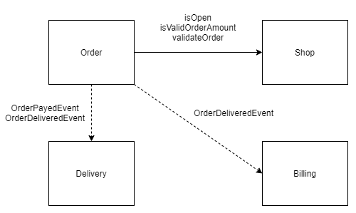

# OOP Practice
> Domain From Woowahan Tech Conference

## This App is
- Mongo base Event Driven Sample
- Requires MongoDB version 4.0 or higher(Transaction Support)
- Local DomainHandler with Spring-ApplicationEventPublisher-EventListener-TransactionalEventListener

## Getting Started
```shell script
#application.yml
mongo:
  uri: <mongoUri>
  database: <mongoDatabase>
  
./gradlew bootRun
```

## Using the Application
Use the Swagger UI to invoke the service(CreateShop/CreateOrder/payedOrder/deliveredOrder)
- http://localhost:8081/swagger-ui.html



## Reference
- https://www.youtube.com/watch?v=dJ5C4qRqAgA
- https://github.com/eternity-oop/Woowahan-OO-03-domain-event
- https://javacan.tistory.com/entry/Handle-DomainEvent-with-Spring-ApplicationEventPublisher-EventListener-TransactionalEventListener
- https://mflash.dev/blog/2019/07/08/persisting-documents-with-mongorepository/
